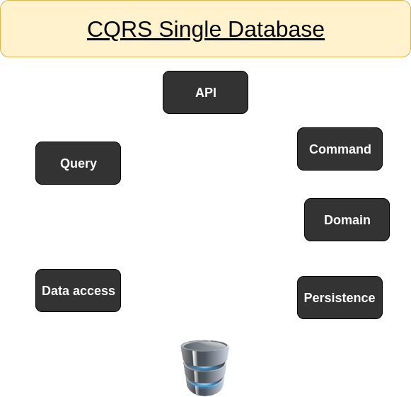
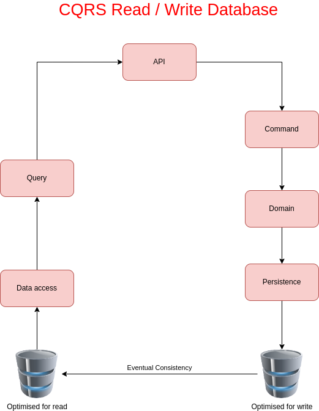

# For persistence DB migration
```sh
dotnet ef migrations add InitialCreate -s API -p Persistence
```
## Explanation for above console
> - InitialCreate is the name of the migration, Conventionally InitialCreate is normally the name for the first migration
> - -s is Start up project, which is our API 
> - -p the where your datacontext resides, which is our persistence project
>> - You may get the following error after running that command "Your startup project 'API' doesn't reference Microsoft.EntityFrameworkCore.Design. This package is required for the Entity Framework Core Tools to work. Ensure your startup project is correct, install the package, and try again." just add the following using nuget gallery 
> - To remove migration use **dotnet ef migrations remove**


# For creating a React application that uses typescript and npm
```sh
npx create-react-app client-app --use-npm --template typescript
```

## Why use React
1. It is a trusted tool by profitable companies like Facebook (creators), Netflix, Instagram, and Airbnb
2. React is fast
3. React is easy to learn
4. It's just a library
5. Uses a Virtual-DOM, which simulates the DOM, causing the DOM not to have to be repaint everytime you change something.
6. Stack overflow developer survey 2020 - most loved web frameworks 
    1. ASP.NET Core = 70.7%
    2. React.js = 68.9%
    3. Vue.js = 66.0%
    4. Express = 61.9%
    5. Gatsby = 60.7% 
    6. Spring = 57.7%
    7. Django = 55.3%
    8. Flask = 54.4% 
    9. Angular = 54.0%
    10. Laravel = 51.5%
    11. Ruby on Rails = 49.3%
    12. Symfony = 45.6%
    13. ASP.NET = 36.9%
    14. jQuery = 36.5%
    15. Drupal = 25.5%
    16. Angular.js = 24.1%
7. It's just javascript (*or typescript* which is compiled to javascript)

## Why use Typescript 
|Typescript Rocks!|Typescript is annoying!|
|-----------------|-----------------------|
|Strong Typing    |More upfront code      |
|Object orientated|3rd Part libraries     |
|Better intellisense|Strict mode is... strict!|
|Access modifiers |                       |
|Future JS Features|                      |
|Catches silly mistakes in dev|           |
|3rd Party libraries|                     |
|Easy to learn if you know JS|            |
|Much improved in React|                  |

## Clean Architecture recommendations 
- [x] Independent from frameworks \ 
- [x] Testable
- [x] Independent from the interface
- [x] Independent from the database

## CQRS (Command Query Responsibility Segragation)
| Command | Query |
| ------- | ----- |
| - [ ] Do something | - [ ] Answers a question|
| - [ ] Modifies State | - [ ] Does not modify State |
| - [ ] Should not return a value | - [ ] Should return a value |

### Will be following this model

### Not following this model but it should be a model to follow in the follow



## Install mediatR.Extensions.Microsoft.DependencyInjection
```sh
cd Application
dotnet add package MediatR
dotnet add package MediatR.Extensions.Microsoft.DependencyInjection --version 11.1.0
```

## Install Automapper for making Update operation for CRUD easier to deal with
```sh
cd Application 
dotnet add package AutoMapper.Extensions.Microsoft.DependencyInjection --version 12.0.1
```
# Packages that are need up to the Axios section 
```sh
npm i axios semantic-ui-react semantic-ui-css uuid
```
# Why MobX?
Working with #mobx is basically a continuous loop of me going "This is way too simple, it definitely won't work" only to be proven wrong.
I have built big apps with MobX already and comparing to the one before that which was using Redux, it is simpler to read and much easier to reason about.

## MobX Core functions
[X] Observables
[X] Actions
[X] Computed properties
[X] Reactions
[X] AutoRun

## MobX Observable
```javascript
import { makeObservable, observable } from "mobx";
import { createContext } from "react";

class DemoStore {
    firstName = 'Bob';
    lastName = 'Smith';

    constructor() {
        makeObservable(this, {
            firstName: observable,
            lastName: observable
        })
    }
}

export default createContext(new DemoStore());
```
## MobX Action (We use actions to update observable states)
```javascript
import { action, makeObservable, observable } from "mobx";
import { createContext } from "react";

class DemoStore {
    firstName = 'Bob';
    lastName = 'Smith';

    constructor() {
        makeObservable(this, {
            firstName: observable, 
            lastName: observable,
            setFirstName: action
        })
    }

    setFirstName = (name: string) => {
        this.firstName = name;
    }
}

export default createContext(new DemoStore());
```
## MobX Computed 
```javascript 
import { action, computed, makeObservable, observable } from "mobx";
import { createContext } from "react";

class DemoStore {
    firstName = 'Bob';
    lastName = 'Smith';

    constructor() {
        makeObservable(this, {
            firstName: observable, 
            lastName: observable, 
            setFirstName: action, 
            fullName: computed
        })
    }

    get fullName() {
        return this.firstName + ' ' + this.lastName;
    }
}

export default createContext(new DemoStore());
```

## MobX MakeAutoObservable 
```javascript 
import {  makeAutoObservable } from "mobx";
import { createContext } from "react";

class DemoStore {
    firstName = 'Bob';
    lastName = 'Smith';

    constructor() {
        makeAutoObservable(this);
    }

    get fullName() {
        return this.firstName + ' ' + this.lastName;
    }

    setFirstName = (name: string) => {
        this.firstName = name;
    }
}

export default createContext(new DemoStore());
```

## MobX Reaction
```javascript 
import { makeAutoObservable, reaction } from "mobx";
import { createContext } from "react";

class DemoStore {
    firstName = 'Bob';
    lastName = 'Smith';

    constructor() {
        makeAutoObservable(this);

        reaction(
            () => this.firstName,
            (firstName) => console.log(firstName)
        )
    }

    setFirstName = (name: string) => {
        this.firstName = name;
    }

    get fullName() {
        return this.firstName + ' ' + this.lastName;
    }
}

export default createContext(new DemoStore());
```

## React Context
```javascript 
import React, { useContext } from 'reaact';
import DemoStore from '../app/demoStore';

export default function Demo() {
    const demoStore = useContext(DemoStore);
    const { fullName } = demoStore;

    return (
        <div>
            <h1>Hello {fullName}</h1>
        </div>
    )
}
```

## React Context pt 2
```javascript 
import { observer } from 'mobx-react-lite';
import React, { useContext } from 'reaact';
import DemoStore from '../app/demoStore';

export default observer( function Demo() {
    const demoStore = useContext(DemoStore);
    const { fullName } = demoStore;

    return (
        <div>
            <h1>Hello {fullName}</h1>
        </div>
    )
}) 
```